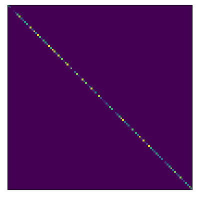
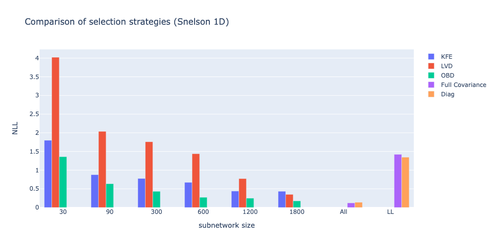
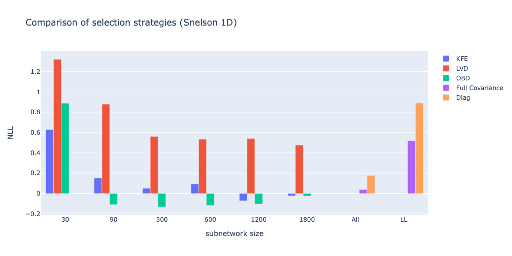
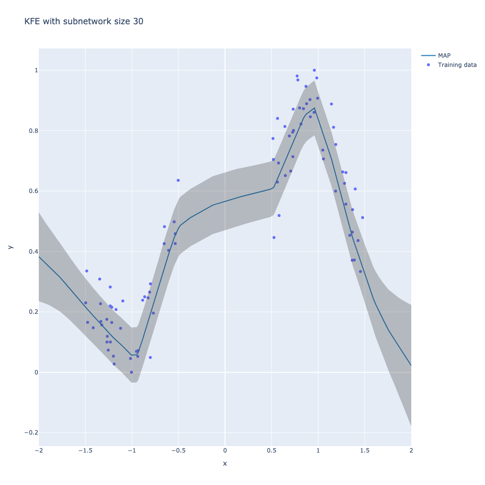

# Bayesian Deep Learning via Subnetwork Inference

## Table of Contents
1. [Introduction](#introduction)
2. [Background](#background)
3. [Subnetwork Inference](#subnetwork-inference)
4. [Exposition of its strengths/weaknesses/potential](#strengths-weaknesses-potential)
5. [Novel contributions](#novel-contribution)
6. [Experiments and results](#experiments-and-results)
7. [Conclusions](#conclusions)

## Introduction

Uncertainty is the only certainty there is and it is imperative for any "intelligent" system to recognize and account for the uncertainty inherent in the world around it. In recent years machine learning and deep learning models have become ubiquitous with wide-ranging applications from medical diagosis to self-driving cars. Many of these models are trained on data which is often noisy, incomplete and susceptible to distributional shifts. This leads to uncertainty in the model's predictions. Therefore, it is essential to measure the uncertainty and have human supervision in the loop especially when the model is deployed for making decisions in safety-critical applications.

Neural networks (NNs) are universal function approximators [Cybenko, 1989; Hornik et al., 1989]. Recently, Deep Neural Networks (DNNs) in particular have achieved tremendous success in learning and generalizing complex patterns and relationships in the data ranging from computer vision to natural language. Yet they are prone to overfitting and are often overconfident in their predictions [Guo et al., 2017].  Uncertainty can be braodly classified into two categories - epistemic and aleatoric uncertainity. While aleatoric uncertainity is because of the noise in the data, epistemic uncertainty is caused by lack of data or distributional shift in the data. Bayesian deep learning (BDL) provides a principled framework to address epistemic uncertainity in neural networks. Additionally, bayesian deep learning also provides a way to incorporate prior knowledge into the model, systematically tune the hyperparameters and also help in addressing the problem of catastrophic forgetting [Kirkpatrick et al., 2016] in continual learning.

Inspite of the theoretical advantages as mentioned above, bayesian deep learning has not been widely adopted in practice especially because of the computational challenges in estimating the posterior distribution of the parameters. In this context, the paper [Bayesian Deep Learning via Subnetwork Inference](https://arxiv.org/abs/2007.06823) by Daxberger et. al, 2021 [2] proposes a simple and cost-effective method to approximate the posterior distribution of the parameters by infering over a subset of network parameters instead of the full network parameters. They empirically show that subnetwork inference achieves considerable results on a variety of datasets. In this blogpost, we will mainly discuss the contributions of the paper by Daxberger et. al, 2021 [2] with a special emphasis on their subnetwork select strategy based on Wasserstein distance. Starting with a brief background on bayesian deep learning, we will introduce various popular methods available for estimating the posterior distribution of the parameters, their advantages and disadvantages followed by a detailed exposition of the subnetwork inference method. Finally, we will discuss two new subnetwork selection strategies that we propose as an extension and do a comparative analysis of their performance on various datasets.

## Background

From a probabilistic standpoint, optimizing a neural network is equivalent to finding a point estimate of the parameters of the network. Depending on the loss function used for optimization, it can either viewed as a Maximum Likelihood Estimate (MLE) or a Maximum A Posteriori (MAP) estimate. In either case the uncertainty in the parameters of the model is not captured. Bayesian deep learning on the other hand moves towards estimating the distribution of the parameters. In the bayesian paradigm, given a dataset $\mathcal D = \{(\mathbf x_i, y_i)\}_{i=1}^N$, where $\mathbf x_i$ and $\mathbf y_i$ are the inputs and target respectively, the goal is to estimate the posterior distribution of the parameters $\mathbf w$ given the data $\mathcal D$. Assuming a prior distribution $p(\mathbf w)$, the posterior distribution is given by

$$
\begin{align}
 p(\mathbf w| \mathcal D) &= p(\mathbf w | \mathbf y, \mathbf X) \nonumber \\
 &= \frac{p(\mathbf y |  \mathbf X, \mathbf w) p(\mathbf w)}{\int p(\mathbf y |  \mathbf X, \mathbf w) p(\mathbf w) d\mathbf w} \tag{1}
\end{align} 
$$

Assuming that the posterior distribution can be estimated, we can factor in the uncertainty of the model by marginalizing over the posterior distribution of the parameters. For new data points $\mathbf X^\prime$, the predictive distribution is given by

$$
\begin{align}
p(\mathbf y^\prime | \mathbf X^\prime, \mathcal D) &= \int p(\mathbf y^\prime | \mathbf X^\prime, \mathbf w) \cdot p(\mathbf w | \mathcal D)  d \mathbf w \tag{2}
\end{align}
$$

Although theoritically it is quite convincing, there are few challenges in the practical implementation of bayesian framework. The posteriors involve integrations over the entire parameter space and considering the size of modern neural network architectures, more often than not it is computationally infeasible. Thus, it is necessary to adopt some form of approximation using inference methods like Mean Field Variational Inference (MFVI), Laplace Approximation (LA) or Markov Chain Monte Carlo (MCMC) to estimate the posterior distribution. Alternatively, one can approach the uncertainty in the models using non-bayesian methods like Monte Carlo Dropout (MC Dropout) [Gal and Ghahramani, 2016] and Deep Ensembles [Lakshminarayanan et al., 2017]. 

MCMC methods are a class of alogirthms based on sampling and are considered to be gold standard for estimating the posterior distribution. In the limit of number of samples, the estimated distribution theoritically converges to the true distribution. But practically, in very high dimensional spaces sampling is computationally expensive and do not scale well to large neural networks. 

Variation Inference (VI) is another class of algorithms that approximate the posterior distribution by first limiting the search space to a family of distributions like Gaussian and then finding a member from the chosen family that is closest to the true posterior distribution by minimizing the Kulback-Leibler (KL) divergence. One popular variant of VI is Mean Field Variational Inference (MFVI) which assumes that the posterior distribution factorizes into independent distributions for each parameter.  Unlike MCMC methods, MFVI is computationally efficient and scale well to large neural networks. But the main drawback of VI methods is that they require architectural modifications to the neural network. Also, the mean field assumption is often too restrictive as the weights in the neural network are usally not independent and it effects the quality of the approximation.

### Laplace approximation

Laplace Approximation (LA) is a simple and cost-effective [Daxberger et. al, 2021] method to approximate the posterior distribution and does not require any architectural modifications to the neural network. Laplace approximation is essentially a local approximation of the posterior distribution around the local maximum given by the MAP estimate. Given a loss function $\mathcal L(\mathcal D, \theta)$, the MAP estimate is given by

$$
\begin{align}
\mathbf \theta_{MAP} &= \arg \min_{\mathbf \theta} \mathcal L(\mathcal D, \mathbf \theta) \tag{3} \\
&= \arg \min_{\mathbf \theta} -  \log p(\mathcal D |\mathbf  \theta) - \log p(\mathbf \theta) \tag{4} \\
\end{align} 
$$

Using Taylor expansion around $\theta_{MAP}$, and ignoring the higher order terms, we can write  $\mathcal L(\mathcal D, \mathbf  \theta)$ as follows.

$$
\mathcal L(\mathcal D, \mathbf  \theta) \approx \mathcal L(\mathcal D, \mathbf  \theta_{MAP}) + \frac{1}{2} (\mathbf  \theta - \mathbf \theta_{MAP})^T \mathbf H(\mathbf \theta_{MAP}) (\mathbf \theta - \mathbf \theta_{MAP}) \tag{5}
$$

where $\mathbf H(\mathbf \theta_{MAP})$ is the Hessian matrix of the loss function evaluated at $\mathbf  \theta_{MAP}$. The first-order term vanishes as $\mathbf  \theta_{MAP}$ is the local minimum. 

$$
\mathcal L(\mathcal D, \mathbf  \theta) \approx  \frac{1}{2} (\mathbf  \theta - \theta_{MAP})^T \mathbf H(\mathbf  \theta_{MAP}) (\mathbf \theta - \mathbf  \theta_{MAP}) \tag{6}
$$

But as described in the equation (1) the posterior distribution is given by,

$$
\begin{align}
p(\theta | \mathcal D) &= \frac{1}{Z} p(\mathcal D | \theta) p(\theta) \tag{7} \\
&= \frac{1}{Z} \exp(-\mathcal L(\mathcal D, \theta)) \tag{8} \\
&= \frac{1}{Z} \exp(-\frac{1}{2} (\mathbf  \theta - \mathbf \theta_{MAP})^T \mathbf H(\mathbf \theta_{MAP}) (\mathbf \theta - \mathbf \theta_{MAP})) \tag{9} \\
\end{align}
$$
where $Z$ is the normalizing constant. From the above derivation, we can identify the laplace approximation as follows.

$$
\begin{align}
p(\theta | \mathcal D) &= \mathcal N(\mathbf  \theta ; \mathbf  \theta_{MAP}, \mathbf H(\mathbf  \theta_{MAP})^{-1}) \tag{10} \\
\end{align}
$$

And the normalizing constant

$$
Z \approx exp(-\mathcal L(\mathcal D, \mathbf  \theta_{MAP}) (2 \cdot \pi)^{\frac{D}{2}} (det(\mathbf H(\mathbf  \theta_{MAP}))^{-\frac{1}{2}} \tag{11}
$$ 

where $D$ is the number of parameters in the model. But as seen above the laplace approximation involves calculating the curvature estimates which is the hessian of the loss function with respect to the model parameters and taking an inverse. Hessians can be approximated by either empirical fisher information matrix or by using a generalized gauss-newton approximation. Although, recent advances in second order optimization techniques allow for efficient computation of the hessian, it is still computationally expensive to compute the inverse of the hessian especially for large neural networks. To address this quadratic complexity of taking inverses of large hessian approximations, Daxberger et. al, 2021 [3] proposed a few alterantive methods with different levels of approximation. The most simplest approximation would be to assume a diagonal factorization by ignoring the off-diagonal elements. This approximation is called diagonal laplace approximation. Essentially it assumes that the parameters are independent like the assumptions made in MFVI. 

#### Hessian Approximations
| Diag | KFAC| Full|
|:-------------------------:|:-------------------------:|:-------------------------:|
| ||  |

Alternatively, one can also assume block-diagonal factorizations such as Kronecker-factored approximate curvature (KFAC),  which capture layer-wise dependencies in the model parameters but assume independence between the layers. KFAC is quite flexible and can be used to induce a structure in to the covariance matrix based on the architecture of the neural network. Further the KFAC-factors approximation can be improved by low-rank approximations of the KFAC factors. As shown above, the diagonal approximation is the simplest and the full approximation is the most expressive. Recent works have also proposed to use low-rank approximations of the hessian matrix directly. Daxberger et. al, 2021 [3] empirically found that the performance of the laplace approximation improves when a more expressive covariance approximation is used and that KFAC approximation provides a good trade-off between performance and computational complexity.

## Subnetwork inference
As described in the above section, it helps to have a more expressive covariance approximation but we are limited by the size of deep neural networks. In this context, Daxberger et. al, 2021 [2] proposed a method called subnetwork inference that allows us to approximate the posterior distribution of the weights in the neural network by infering over a subset of parameters while keeping the rest of the parameters as point estimates. They propose subnetwork selection strategies to choose a subset S << D without loosing much on the model performance. Since size of the subset is much smaller compared to the size of the neural network, it is possible to use more expressive covariance approximations.  Once the inference is done over the subset of parameters the posterior over the network can be approximated as follows.

$$
\begin{align}
p(\mathbf w | \mathcal D) \approx p(\mathbf w_S | \mathcal D) \prod_{r} \delta(\mathbf w_r - \mathbf {\hat w_r}) \tag{12} \\
\approx q(\mathbf w_S)\prod_{r} \delta(\mathbf w_r - \mathbf {\hat w_r})  \tag{13}
\end{align}
$$

The authors propose a subnetwork selection strategy based squared Wasserstein distance. Though the end goal is to choose a subnetwork such that the predictive posterior constructed from the subnetwork is close to the predictive posterior constructed from the full network, as reasoning directly in the function space is difficult  [Nalisnick & Smyth, 2018; Nalisnick et. al 2021] the authors instead propose to minimize the distance between posterior distributions in the weight space. They choose to minimize the squared Wasserstein distance between the posterior distributions of the weights instead of the KL divergence as it is not well defined for the Dirac delta distributions with disjoint support as derived in equation (10).

### Wassertein distance
The wasserstein distance between two Gaussian distributions can be calculated using the closed-form solution as given below.

$$
\begin{align}
W_2(\mathcal N(\mathbf u_1, \Sigma_1), \mathcal N(\mathbf u_1, \Sigma_1)) = \Vert \mathbf u_1 - \mathbf u_2 \Vert_2^2 + Tr(\Sigma_1 + \Sigma_2 - 2(\Sigma_1^{\frac{1}{2}} \Sigma_2 \Sigma_1^{\frac{1}{2}})^{\frac{1}{2}}) \tag{14}
\end{align}
$$

For the linearized laplace approximation that the authors use, the posterior distribution of the weights is approximately Gaussian or in some cases a true Gaussian. Thus, the wasserstein distance between the posterior distributions of the weights can be calculated using the above closed-form solution. But this is still not computationally feasible for large neural networks as we can not compute the full covariance matrix in the first place. To address this issue, the authors propose to use a diagonal approximation of the covariance matrix of the full network at the subnetwork selection stage and once the subnetwork is selected, they propose to use a more expressive covariance approximation for the subnetwork.

$$
\begin{align}
W_2(p(\mathbf w | \mathcal D), p(\mathbf w_S | \mathcal D)) &= \cancel {\Vert \mathbf w - \mathbf w_S \Vert_2^2} + Tr(\Sigma + \Sigma_S - 2(\Sigma^{\frac{1}{2}} \Sigma \Sigma_s^{\frac{1}{2}})^{\frac{1}{2}}) \tag{15} \\
&= Tr(H^{-1} + H_{S+}^{-1} - 2(H_{S+}^{-1/2} H^{-1} H_{S+}^{-1/2})^{\frac{1}{2}}) \tag{16} \\
&= Tr(H^{-1}) + Tr(H_{S+}^{-1}) - 2Tr( H^{-1/2} H_{S+}^{-1/2})\tag{17}  \\
&= \sum_{d=1}^D \sigma_d^2(1-m_d) \tag{18} 
\end{align}
$$

where $H_{S+}$ is the Hessian matrix of the subnetwork padded with zeros in the positions corresponding to the weights that are not in the subnetwork and $m_d$ is the mask set to $1$ when the weight is included in the subnetwork or otherwise 0.

The above derivation can be interpreted as selection of weights in the full network with the maximum marginal variance. Intuitively, selecting the weights with the maximum marginal variance is equivalent to selecting the weights with the maximum uncertainty. It is important to make a distinction between the strategy proposed by the authors to that of the pruning techniques used in literature where the weights with the smallest magnitude are pruned. The pruning techniques are mainly motivated and optimized to retain the maximum predictive performance where as the goal in the subnetwork inference is to retain the maximum uncertainty. 

### Strengths, Weaknesses, Potential
The main strength of the bayesian deep learning via subnetwork inference as proposed by Daxberger et al. 2021 is that it is provides a posthoc approximation to the posterior distribution that is computationally feasible even for very large neural networks. The authors empirically show that the subnetwork inference is able to capture the uncertainty in the model and is able to outperform other methods in terms of calibration. They show that on smaller tabular datasets like UCI for regression and also do extensive experiments in image classification tasks including distribution shifts by rotating the MNIST dataset images and corrputed CIFAR10 dataset. Their approach consistently outperforms other methods evaluated using Log likelihood and calibration metrics.

The main weakness of the method is that the subnetwork selection strategy is not theoritically founded. Although empirically the method works well, it is not clear if the subnetwork selection strategy is optimal. The authors also do not provide any theoretical guarantees on the subnetwork selection strategy. Thus, it is open to explore if there are better subnetwork selection strategies motivating the current work.

Yet the paper opens new vistas for applying bayesian deep learning to large neural networks. Since the subnetwork inference using Laplace approximation can be even applied post-hoc without any architectural changes, it is easier to adopt the method in practice.  

## Novel contribution
We extend the work of Daxberger et al. 2021 by exploring a novel subnetwork selection strategies going beyond the one proposed by the authors. We mainly experiment with two different approaches.

### KFAC based subnetwork selection strategy
As discussed earlier, Daxberger et al. 2021 in ther laplace redux paper show that more expressive covariance approximation perform better in terms of calibration. They empirically show that KFAC works better than diagonal approximation. Thus, we propose to use KFAC approximation for the full network and use the wasserstein distance to select the subnetwork instead of the diagonal approximation proposed by the authors.

This includes the following steps.

1. Apply KFAC variant of laplace approximation over the full network
2. Compute the wasserstein distance between the posterior distribution of the full network and the subnetwork
    - Derive a closed form solution if possible.
    - Use the ideas from EigenDamage [Wang et. al 2019] where they select weights for pruning based on network reparametrization using Kronecker-factored eigenbasis.
    - If none of the above is possible, use ideas from differential masking paper where the masks are learnt using optimization by replacing the discrete masks with stochastic masks during training.

3. Select the subnetwork based on the wasserstein distance computed in the previous step.
4. Apply full covariance approximation for the subnetwork.
5. Repeat the experiments in the paper and compare the results.

### Pruning based subnetwork selection strategy
We also propose to use one of the second order derivatives based pruning techniques like Optimal Brain Damage (OBD) (LeCun et al., 1990) or Optimal Brain Surgery (OBS) (Hassibi et al., 1993) to first reduce the network and then apply the subnetwork inference only on the remaining weights.

This includes the following steps.
1. Apply OBD or OBS to prune the network.
2. Apply full covariance approximation for the pruned network.
3. Repeat the experiments in the paper and compare the results.

Our hypothesis is that pruning based subnetwork selection strategies shouldn't perform well as the pruning techniques are mainly motivated and optimized to retain the maximum predictive performance where as the goal in the subnetwork inference is to retain the maximum uncertainty as described above.

## Experiments and results
### Snelson 1D experiments
#### Snelson 1D Negative Log Likelihood comparison

|Seed 1 | Seed 2 | Seed 3|
|:-------------------------:|:-------------------------:|:-------------------------:|
| | ||

#### Snelson 1D predictive distributions with different subnetwork selection strategies
LargestVarianceDiagLaplaceSubnetMask (LVD)
| Subnetwork Size 30| Subnetwork Size 300 | Subnetwork Size 1200 |
|:-------------------------:|:-------------------------:|:-------------------------:|
| | ||

OptimalBrainDamageSubnetMask (OBD)

| Subnetwork Size 30| Subnetwork Size 300 | Subnetwork Size 1200 |
|:-------------------------:|:-------------------------:|:-------------------------:|
| | ||

KroneckerFactoredEigenbasisSubnetMask (KFE)

| Subnetwork Size 30| Subnetwork Size 300 | Subnetwork Size 1200 |
|:-------------------------:|:-------------------------:|:-------------------------:|
| | ||

### UCI experiments
#### Mean Negative Log Likelihood comparison on Wine dataset
|Wine | Wine-gap |
|:-------------------------:|:-------------------------:|
| | |

#### Mean Negative Log Likelihood comparison on Wine dataset
|Kin8nm | Kin8nm-gap |
|:-------------------------:|:-------------------------:|
| | |

## Conclusion
TBA

## References

[1] Yarin Gal. Uncertainty in deep learning. University of Cambridge, 2016.

[2] Daxberger, Erik, Eric Nalisnick, James Urquhart Allingham, Javier Antorán, and José Miguel Hernández-Lobato. “Bayesian Deep Learning via Subnetwork Inference.” arXiv, March 14, 2022. (http://arxiv.org/abs/2010.14689)

[3] Daxberger, Erik, Agustinus Kristiadi, Alexander Immer, Runa Eschenhagen, Matthias Bauer, and Philipp Hennig. “Laplace Redux -- Effortless Bayesian Deep Learning.” arXiv, March 14, 2022. (http://arxiv.org/abs/2106.14806)

[4] Foong, Andrew Y. K., Yingzhen Li, José Miguel Hernández-Lobato, and Richard E. Turner. “‘In-Between’ Uncertainty in Bayesian Neural Networks.” arXiv, June 27, 2019. (http://arxiv.org/abs/1906.11537)

[5] Izmailov, Pavel, Wesley J. Maddox, Polina Kirichenko, Timur Garipov, Dmitry Vetrov, and Andrew Gordon Wilson. “Subspace Inference for Bayesian Deep Learning.” arXiv, July 17, 2019. (https://doi.org/10.48550/arXiv.1907.07504)

[6] Wang, Chaoqi, Roger Grosse, Sanja Fidler, and Guodong Zhang. “EigenDamage: Structured Pruning in the Kronecker-Factored Eigenbasis.” In Proceedings of the 36th International Conference on Machine Learning, 6566–75. PMLR, 2019. (https://proceedings.mlr.press/v97/wang19g.html)

[7] LeCun, Y., Denker, J. S., and Solla, S. A. Optimal brain damage. In Advances in neural information processing systems, pp. 598–605, 1990.

[8] Hassibi, B., Stork, D. G., and Wolff, G. J. Optimal brain surgeon and general network pruning. In Neural Networks, 1993., IEEE International Conference on, pp. 293–299. IEEE, 1993.

[9] Hornik, Kurt et al. “Multilayer feedforward networks are universal approximators.” Neural Networks 2 (1989): 359-366.

[10] Cybenko, G. Approximation by superpositions of a sigmoidal function. Math. Control Signal Systems 2, 303–314 (1989). (https://doi.org/10.1007/BF02551274)

[11] Guo, Chuan et al. “On Calibration of Modern Neural Networks.” International Conference on Machine Learning (2017).

[12] Kirkpatrick, James et al. “Overcoming catastrophic forgetting in neural networks.” Proceedings of the National Academy of Sciences 114 (2016): 3521 - 3526.

[13] Gal, Yarin and Zoubin Ghahramani. “Dropout as a Bayesian Approximation: Representing Model Uncertainty in Deep Learning.” ArXiv abs/1506.02142 (2015).

[14] Lakshminarayanan, Balaji et al. “Simple and Scalable Predictive Uncertainty Estimation using Deep Ensembles.” ArXiv abs/1612.01474 (2016).

[15] Alex Graves. Practical Variational Inference for Neural Networks. In NIPS, 2011.

[16] Izmailov, P., Maddox, W. J., Kirichenko, P., Garipov, T., Vetrov, D., and Wilson, A. G. Subspace inference for bayesian deep learning. In UAI, 2019.

[17] Nalisnick, E. T. and Smyth, P. Learning priors for invariance. In AISTATS, 2018.

[18] Nalisnick, E. T., Gordon, J., and Hern ́ andez-Lobato, J. M. Predictive complexity priors. In AISTATS, 2021.

[19] Wang, Chaoqi, Roger Grosse, Sanja Fidler, and Guodong Zhang. “EigenDamage: Structured Pruning in the Kronecker-Factored Eigenbasis.” In Proceedings of the 36th International Conference on Machine Learning, 6566–75. PMLR, 2019. https://proceedings.mlr.press/v97/wang19g.html.

 
